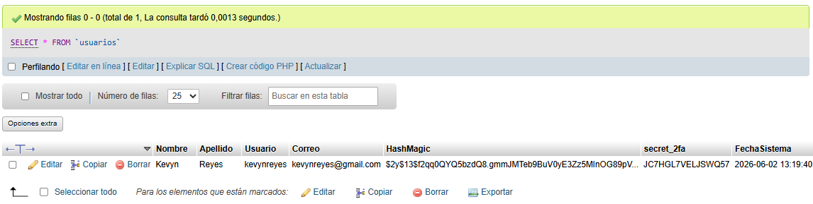
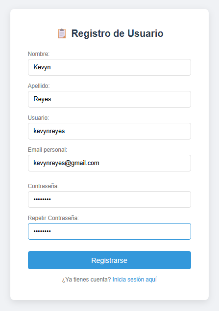
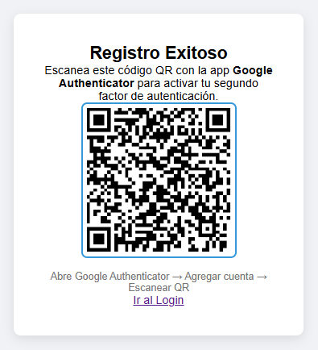
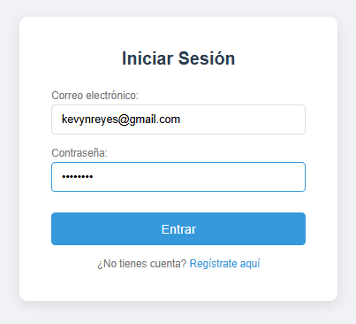
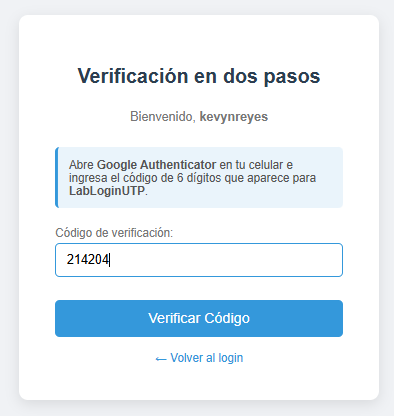
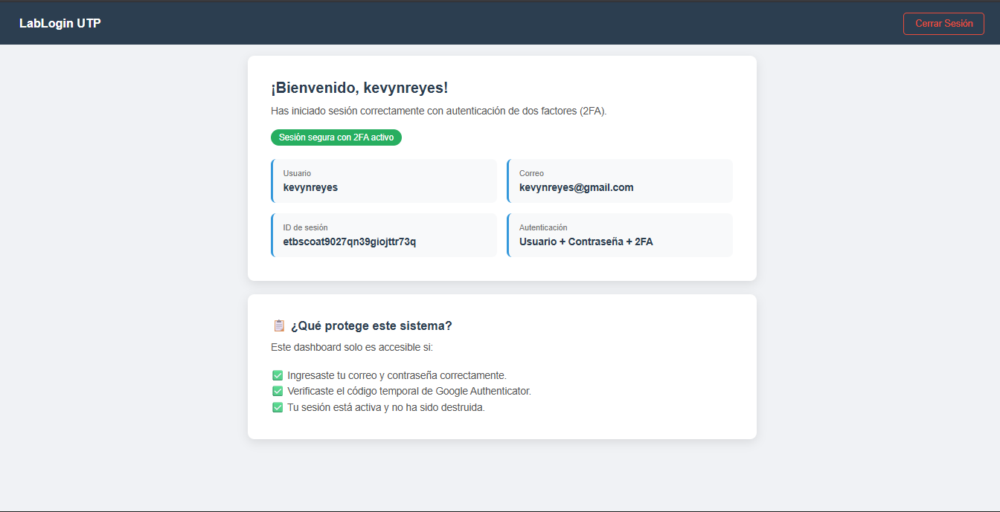
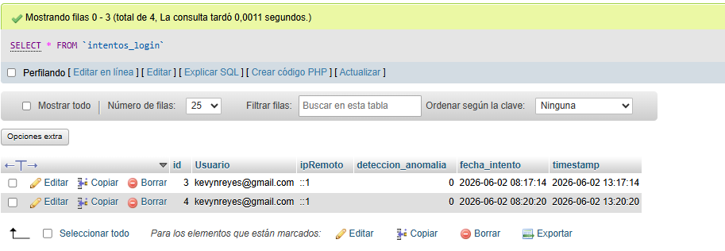

# 🔐 LabLogin - Sistema de Autenticación con 2FA


---

## 📋 Información General

| Campo | Detalle |
|---|---|
| **Universidad** | Universidad Tecnológica de Panamá |
| **Facultad** | Facultad de Ingeniería en Sistemas |
| **Carrera** | Licenciatura en Desarrollo y Gestión de Software |
| **Materia** | Desarrollo de Software VII |
| **Instructora** | Ing. Irina Fong |
| **Semestre** | I Semestre 2026 |

---

## 👨‍💻 Autores

| Nombre | Correo |
|---|---|
| Aaron López | aaron.lopez2@utp.ac.pa |
| Kevyn Reyes | kevyn.reyes@utp.ac.pa |

---

## 📌 Descripción del Proyecto

**LabLogin** es un sistema de autenticación web desarrollado en PHP con MySQL que implementa:

- Registro de usuarios con contraseñas encriptadas mediante `bcrypt`
- Inicio de sesión seguro con manejo de sesiones PHP
- Autenticación de Dos Factores (2FA) usando Google Authenticator (estándar TOTP)
- Auditoría de intentos de login con detección de anomalías por IP
- Sanitización estricta de entradas y consultas preparadas (PDO)
- Arquitectura orientada a objetos con separación de responsabilidades

Este laboratorio aplica principios del modelo **Zero Trust** y buenas prácticas alineadas con la **Ley 81 de Protección de Datos Personales de Panamá**.

---

## 🚀 Flujo de Autenticación

```
[Registro] → [Escaneo QR con Google Authenticator]
     ↓
[Login: correo + contraseña]
     ↓
[Verificación código TOTP de 6 dígitos]
     ↓
[Acceso al Dashboard]
```

---

## 🛠️ Tecnologías Utilizadas

| Tecnología | Uso |
|---|---|
| PHP 8.4 | Lógica del servidor |
| MySQL 8 | Base de datos |
| WAMP Server | Servidor local de desarrollo |
| PDO | Conexión segura a la base de datos |
| Composer | Gestión de dependencias |
| sonata-project/google-authenticator | Generación y verificación de códigos TOTP |
| jQuery Validation | Validación del formulario en el cliente |
| AJAX | Verificación de correo duplicado en tiempo real |

---

## 📁 Estructura del Proyecto

```
LabLogin/
├── clases/
│   ├── mysql.inc.php           # Clase de conexión PDO a la BD
│   ├── SanitizarEntrada.php    # Clase para sanitizar y validar entradas
│   ├── ClaseRegistrese.php     # Clase para registro de usuarios
│   └── verificarCorreo.php     # Verifica correo duplicado vía AJAX
├── comunes/
│   └── loginfunciones.php      # Funciones reutilizables: sesión, auditoría, redirección
├── Estilos/
│   └── estilos.css             # Estilos globales del proyecto
├── screenshots/                # Capturas de pantalla del sistema
├── vendor/                     # Dependencias instaladas por Composer
├── registrese_form.php         # Formulario de registro de usuario
├── login.php                   # Página de inicio de sesión
├── verificar2fa.php            # Verificación del código 2FA
├── dashboard.php               # Página protegida post-autenticación
├── salir.php                   # Cierre de sesión
├── composer.json               # Configuración de dependencias
└── README.md                   # Este archivo
```

---

## 🗄️ Base de Datos

**Nombre:** `company_info`

### Tabla `usuarios`

Almacena los datos de los usuarios registrados.

| Columna | Tipo | Descripción |
|---|---|---|
| `id` | INT AUTO_INCREMENT | Clave primaria |
| `Nombre` | VARCHAR(255) | Nombre del usuario |
| `Apellido` | VARCHAR(255) | Apellido del usuario |
| `Usuario` | VARCHAR(255) | Nombre de usuario |
| `Correo` | VARCHAR(255) | Correo electrónico (usado como login) |
| `HashMagic` | VARCHAR(255) | Contraseña encriptada con bcrypt |
| `secret_2fa` | VARCHAR(255) | Secreto TOTP para Google Authenticator |
| `FechaSistema` | DATETIME | Fecha y hora de registro |

### Tabla `intentos_login`

Registra cada intento de login para auditoría y detección de anomalías.

| Columna | Tipo | Descripción |
|---|---|---|
| `id` | INT AUTO_INCREMENT | Clave primaria |
| `usuario` | VARCHAR(50) | Correo del usuario que intentó ingresar |
| `ipRemoto` | VARCHAR(191) | IP desde donde se realizó el intento |
| `deteccion_anomalia` | TINYINT(1) | 1 si se detectó comportamiento anómalo |
| `timestamp` | DATETIME | Fecha y hora del intento |

---

## 📸 Capturas de Pantalla

### Base de datos vacía (sin usuarios)


### Registro de un nuevo usuario


### Código QR para Google Authenticator


### Inicio de sesión


### Solicitud del código de verificación 2FA


### Dashboard tras autenticación exitosa


### Tabla de intentos de login


---

## ⚙️ Instalación y Configuración

### Requisitos previos

- WAMP Server instalado y corriendo
- PHP 8.x
- MySQL 8.x
- Composer instalado
- Google Authenticator instalado en tu celular

### Pasos

**1. Clonar o copiar el proyecto**

Coloca la carpeta `LabLogin/` dentro de:
```
C:\wamp64\www\
```

**2. Crear la base de datos**

Abre phpMyAdmin y ejecuta:
```sql
CREATE DATABASE company_info;

CREATE TABLE IF NOT EXISTS `usuarios` (
  `id` int NOT NULL AUTO_INCREMENT,
  `Nombre` varchar(255) COLLATE utf8mb4_bin NOT NULL,
  `Apellido` varchar(255) COLLATE utf8mb4_bin NOT NULL,
  `Usuario` varchar(255) COLLATE utf8mb4_bin NOT NULL,
  `Correo` varchar(255) COLLATE utf8mb4_bin NOT NULL,
  `HashMagic` varchar(255) COLLATE utf8mb4_bin NOT NULL,
  `secret_2fa` varchar(255) COLLATE utf8mb4_bin NOT NULL,
  `FechaSistema` datetime NOT NULL,
  PRIMARY KEY (`id`)
) ENGINE=InnoDB DEFAULT CHARSET=utf8mb4 COLLATE=utf8mb4_bin;

CREATE TABLE IF NOT EXISTS `intentos_login` (
  `id` int NOT NULL AUTO_INCREMENT,
  `usuario` varchar(50) NOT NULL,
  `ipRemoto` varchar(191) NOT NULL,
  `deteccion_anomalia` tinyint(1) NOT NULL,
  `timestamp` datetime NOT NULL DEFAULT CURRENT_TIMESTAMP,
  PRIMARY KEY (`id`)
);
```

**3. Crear usuario de base de datos**

```sql
CREATE USER 'tu_usuario'@'localhost' IDENTIFIED BY 'tu_contraseña';
GRANT ALL PRIVILEGES ON company_info.* TO 'tu_usuario'@'localhost';
FLUSH PRIVILEGES;
```

**4. Configurar la conexión**

Abre `clases/mysql.inc.php` y actualiza:
```php
$sql_user = "tu_usuario";
$sql_pass = "tu_contraseña";
```

**5. Instalar dependencias**

Desde la raíz del proyecto en PowerShell o CMD:
```bash
composer require sonata-project/google-authenticator
```

**6. Abrir en el navegador**
```
http://localhost/LabLogin/registrese_form.php
```

---

## 🔒 Características de Seguridad

- **Hashing con bcrypt** — Las contraseñas nunca se almacenan en texto plano. Se usa `PASSWORD_BCRYPT` con costo 13.
- **Consultas preparadas PDO** — Previene inyección SQL en todas las operaciones de base de datos.
- **Sanitización de entradas** — Todos los datos del usuario pasan por la clase `SanitizarEntrada` antes de ser procesados.
- **Sesiones seguras** — Las páginas protegidas verifican el estado de sesión con `bloqueSeguridadSesion()`.
- **Auditoría de accesos** — Cada intento de login queda registrado con IP y timestamp.
- **Detección de anomalías** — Si hay 5 o más intentos fallidos desde la misma IP en 15 minutos, se marca como anomalía.
- **2FA con TOTP** — El segundo factor usa el estándar Time-Based One-Time Password con ventana de 30 segundos.
- **Usuario de BD no root** — La conexión usa un usuario con permisos limitados a la base de datos del proyecto.

---

## ⚠️ Nota sobre sincronización de hora

La verificación 2FA depende de que la hora del servidor esté sincronizada con la del celular. Si los códigos no coinciden:

En Windows: **Configuración → Hora e idioma → Fecha y hora → Sincronizar ahora**

---

## 📚 Recursos de Referencia

- [PHP password_hash — Manual oficial](https://www.php.net/manual/es/function.password-hash.php)
- [sonata-project/google-authenticator](https://github.com/sonata-project/GoogleAuthenticator)
- [Implementando 2FA en PHP](https://nelkodev.com/php/implementando-autenticacion-de-dos-factores-en-php-una-guia-integral/)
- [Repositorio base del laboratorio](https://github.com/Salomon2514/EjemploBaseLogin)
